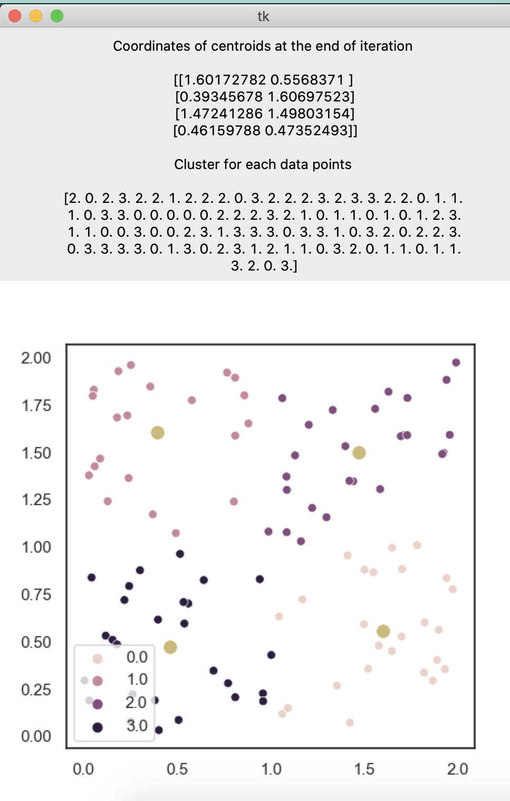

#Question: Kmean
Given a set of two dimensional points P (e.g. [(1.1, 2.5), (3.4,1.9)...]; the size of set can be100s), write a function that calculates simple K-means. The expected returned value from the function is 1) a set of cluster id that each point belongs to, and 2) coordinates of centroids at the end of iteration.

Although you can write this in any language, we would recommend for you to use python.Please feel free to research and look up any information you need, but please note plagiarism will not be tolerated.You may spend as much time as needed, but as a frame of reference, an hour would be the maximum time frame. If more time is required, please send over the intermediate code at the one hour mark.

You may start the assignment whenever you are ready. Once you have completed this task, get back to us along with the code and how long it took you.Please feel free to get in touch with me if you encounter any questions or problems.

Requirements:

    Minimum: implementation of the k-means function
    Expected: implement an interface similar to sklearn (subset is fine)
    Bonus: test code Bonus: visualization

#RunCode

    python kmeans.py

#Display

